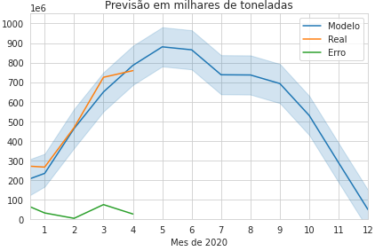

# Predição de exportação de grãos no porto de Santarém com Inteligencia Artificial.

Olá!

Esse reposítorio foi criando com dados abertos do ministério do comercio exterior com dados até o mês de abril de 2020, com a intenção de criar um sistema de inteligencia artificial para predizer a quantidade de gãos que serão exportados no porto de Santarém mês a mês.

A analise pode ser vista no arquivo [Análise](Analise_Exportação_Por_porto_Santarém.ipynb)

Até então o modelo tem se mostrado um sucesso, contendo erros conhecidos de no máximo 15%.

O modelo é composto de séries de Fourier com tendência quadratica implementado utilizando a API curve_fit da bibliotéca Scipy. Foram utilizados apenas dados históricos, sem dados exógenos, como previsão do tempo ou analises de sentimento se sites de análise.

Abaixo uma foto do modelo com dados do Min. do comercio exterior até 04/2020

